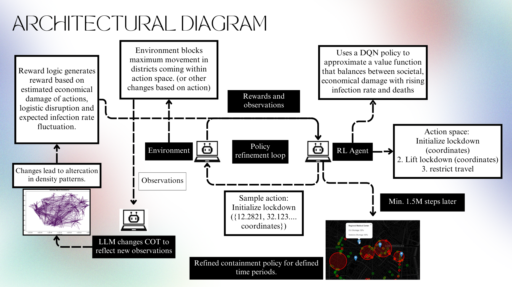
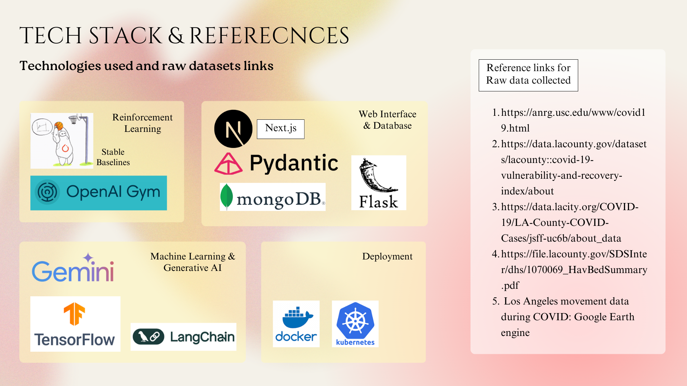
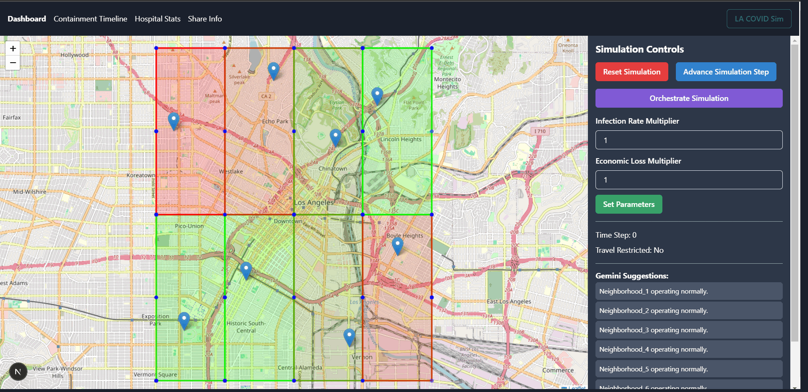

# 🧬 COVID Digital Twin & Containment Simulation

A digital twin of an urban environment powered by AI agents and Reinforcement Learning to simulate, analyze, and optimize pandemic containment strategies.

---

## 🎯 Objectives

- **Simulate Realistic Human Agents to Model Urban Dynamics**  
  Create human-like agents with lifelike demographics, routines, and behaviors that evolve over time, reflecting real-world social dynamics. This helps uncover patterns that drive smarter policy and resource planning during pandemics.

- **Train RL Agents for Disease Containment**  
  Utilize Reinforcement Learning to develop adaptive containment strategies (like dynamic lockdowns) that minimize disease spread while balancing economic and societal impacts.

---

## 🧠 Overview

This project combines **agent-based modeling** with **reinforcement learning** to build a **dynamic digital twin** of a city (modeled on Los Angeles). Each AI agent simulates real human behavior, allowing the system to evaluate and adapt containment strategies in response to pandemic scenarios.

---

## 🔑 Key Features

### 🏙️ Digital Twin of a City

Simulates thousands of realistic human-like agents in a virtual city with detailed spatial geography and movement dynamics based on historical epidemic/pandemic data.

### 🔁 Chain-of-Thought Driven Routines

Agents follow daily schedules generated using large language models to mimic diverse real-world behaviors and responses under epidemic conditions.

### 🧪 RL-Based Policy Optimization

Custom OpenAI Gym environment enables RL agents to learn dynamic intervention policies (e.g., selective lockdowns) using algorithms like **Proximal Policy Optimization (PPO)**.

### 🏥 Predictive Healthcare Insights

- Forecasts shortages in medical equipment, ICU beds, and medicine.
- Simulates the impact of travel restrictions and lockdowns on healthcare logistics.

### 🧩 Modular Architecture

- **Frontend:** Interactive dashboard (Next.js) with maps (Leaflet) and charts for visualization.
- **Backend:** Flask-based API hosting the simulation logic and chain-of-thought reasoning.
- **ML Module:** Scripts and environments for RL training using `stable-baselines3`.

---

## 🧬 How It Works



### 🔹 Agent-Based Simulation

Each agent is initialized with a profile and dynamic routine. They interact, move, and influence infection dynamics across city neighborhoods.

### 🔹 Data-Driven Urban Modeling

Tracks time-series data like population density, infection rates, and economic loss. Enables realistic forecasting and planning.

### 🔹 Reinforcement Learning for Policy Optimization

Encapsulated in a custom Gym environment. The RL agent learns when and where to apply interventions to contain disease spread optimally.

### 🔹 Visualization & Insights

Real-time maps and dashboards show:

- Agent movements
- Infection spread
- Hospital resource predictions
- RL policy plans

---

## 🖥️ Tech Stack



---

## 📷 Gallery



---

## 🚀 Getting Started

### 🔧 Prerequisites

- Node.js & npm
- Python 3.8+
- MongoDB

## 📁 Directory Structure

```
HealthX/
  ├── backend/        # Flask app, simulation engine, RL environment
  └── frontend/       # Next.js frontend with interactive maps & controls
```

---

### 🛠️ Manual Setup

1. **Backend**

   ```bash
   cd HealthX/backend
   pip install -r requirements.txt
   python app.py
   ```

2. **Frontend**
   ```bash
   cd HealthX/frontend
   npm install
   npm run dev
   ```

---

## 📊 Sample Outputs

- 📌 **Interactive Map:** Live city simulation with infection and economic overlays.
- 📈 **Containment Timeline:** RL-generated policy sequence (lockdowns/travel bans).
- 🏥 **Hospital Insights:** Shortage forecasts and surplus indicators.
- 🧠 **Gemini Suggestions:** AI-generated recommendations for resource management.

---

## 📌 Note

This project is a research-oriented prototype and not intended for real-world deployment without further clinical and epidemiological validation.
